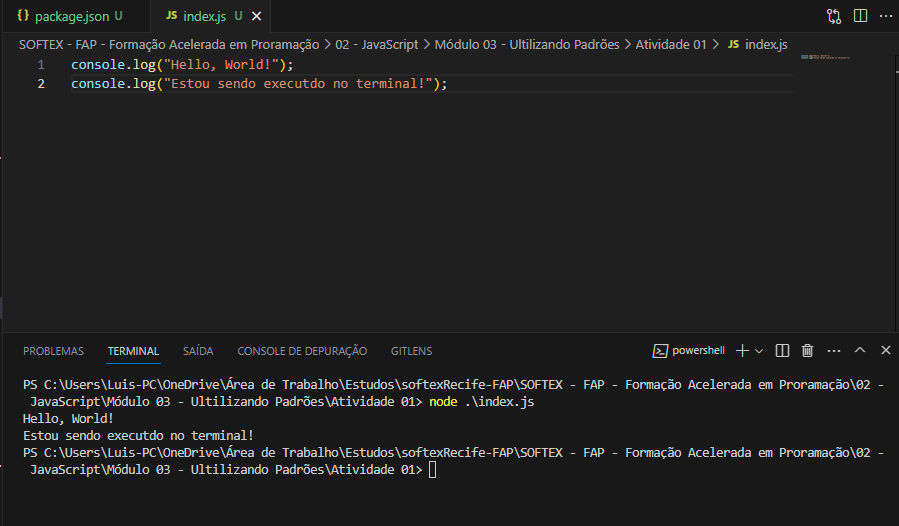

# Atividade

Escolha algum código executável em JavaScript feito em atividades passadas e o coloque no Node.js. Para isso, você deve ter o
Node.js instalado. Após fazer essa migração, coloque seu código no arquivo "index.js”, teste e tire um print.

Trabalhe esse código em seu IDE, suba ele para sua conta no GitHub e compartilhe o link desse projeto no campo ao lado para que
outros desenvolvedores possam analisá-lo.

## Resposta

- Código executado no terminal. 



- package.json

``` json 
{
    "name": "atividade_node.js",
    "version": "1.0.0",
    "description": "Atividade Node.JS",
    "main": "index.js",
    "scripts": {
      "test": "echo \"Error: no test specified\" && exit 1"
    },
    "keywords": [
      "node.js"
    ],
    "author": "Luis Santos",
    "license": "ISC"
  }
```
- Index.js

```javascript 
console.log("Hello, World!");
console.log("Estou sendo executdo no terminal!");
```
